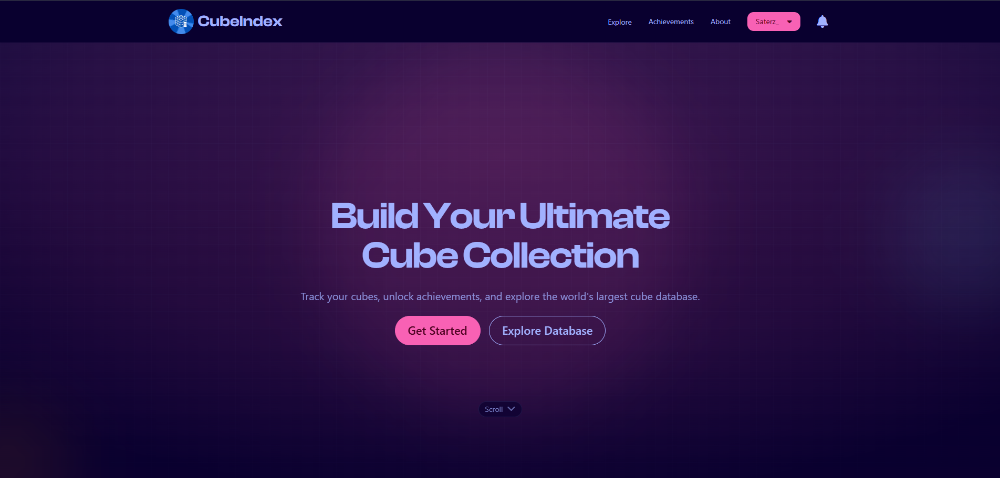
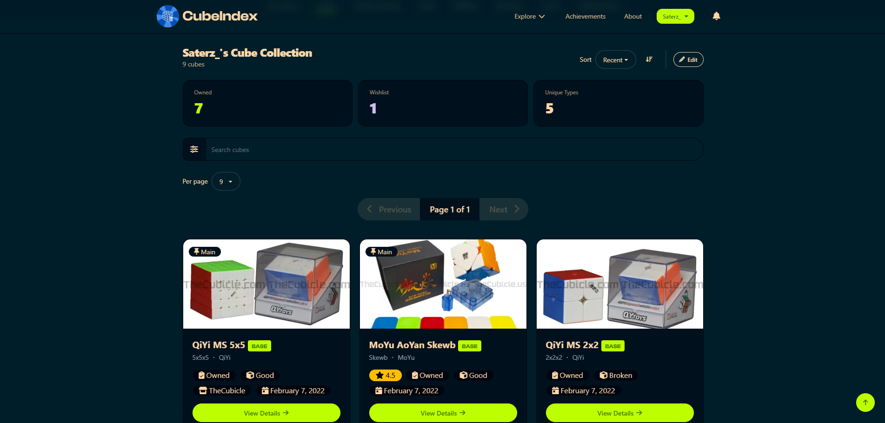
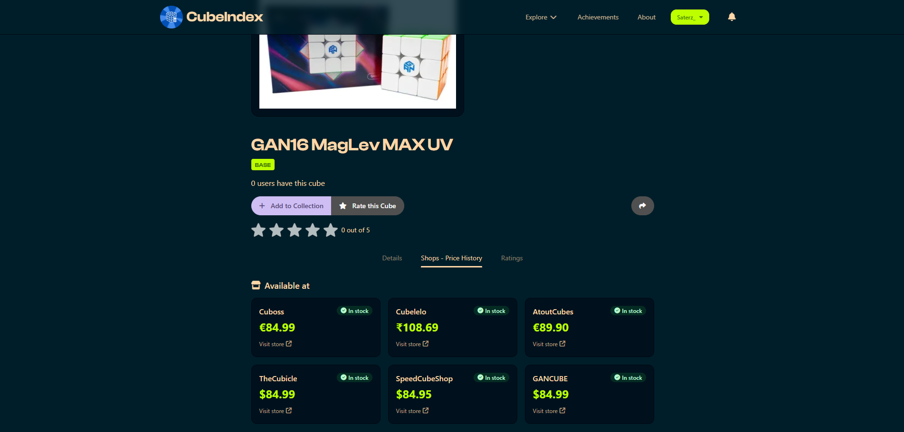

# CubeIndex

<p align="center">
  
</p>

<p align="center">
  <strong>Track your cubes, unlock achievements, and explore the world's largest cube database.</strong><br/>
</p>

<p align="center">
   <a href="https://thecubeindex.com/discord"></a>
  <a href="https://github.com/cubeindex-project/CubeIndex/stargazers"></a>
  <a href="https://github.com/cubeindex-project/CubeIndex/blob/main/LICENSE"></a>
</p>

<details>
<summary>📸 See Screenshots</summary>
<br/>
<div align="center" style="display: flex; flex-wrap: wrap; justify-content: center; gap: 12px;">
  
  
  
</div>
</details>

---

### 🚀 Tech & Deploy

**Built with:** SvelteKit · Tailwind · Supabase · TypeScript  
**Live:** [cubeindex.netlify.app](https://cubeindex.netlify.app)  
**Beta:** [cubeindexbeta.netlify.app](https://cubeindexbeta.netlify.app)

[](https://app.netlify.com/projects/cubeindex/deploys)

---

### ⚡ Quick Start

```bash
git clone https://github.com/cubeindex-project/CubeIndex.git
cd CubeIndex
npm install
cp .env.example .env
npm run dev
```

👉 Visit localhost:5173
(Optional: set up Supabase CLI + Docker if working with the database)

---

🤝 Contribute

- Branch off developer

- Use clear commit names (fix: login bug)

- Open PRs with context

- Join us on Discord

```bash
git checkout -b feat/my-feature
git commit -m "feat: add feature"
git push origin feat/my-feature
```

---

🌍 Community

💬 [Discord](https://cubeindexbeta.netlify.app/discord) · 🐞 [GitHub Issues](https://github.com/cubeindex-project/CubeIndex/issues)

---

⭐ Extras

[](https://www.star-history.com/#Saterz/CubeIndex&Date)

---

📄 Licensed under Apache 2.0  
Thanks for helping build CubeIndex! 🧊
