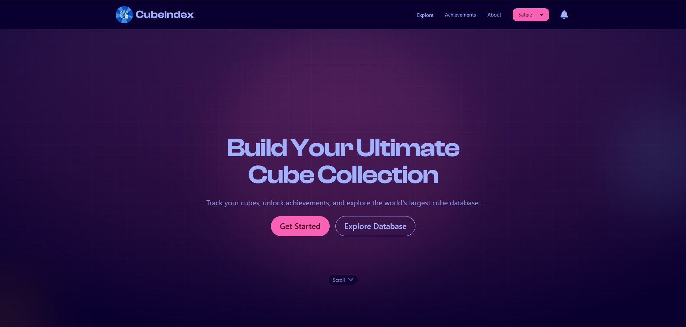
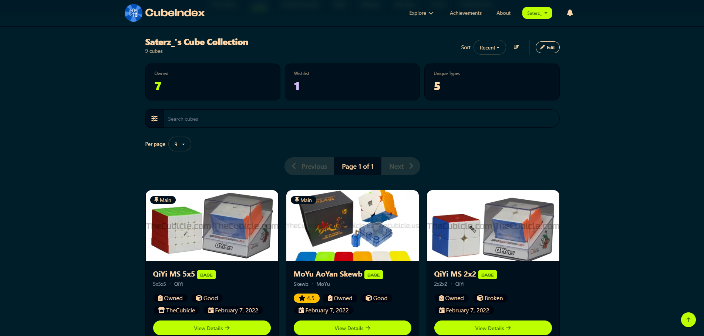
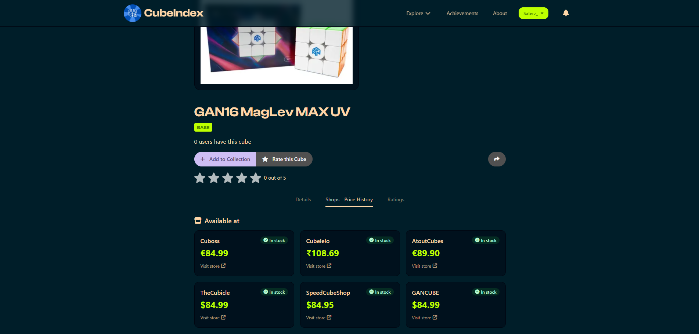

# CubeIndex

<p align="center">
  
</p>

<p align="center">
  <strong>Track your cubes, unlock achievements, and explore the world's largest cube database.</strong><br/>
</p>

<p align="center">
   <a href="https://thecubeindex.com/discord"></a>
  <a href="https://github.com/cubeindex-project/CubeIndex/stargazers"></a>
  <a href="https://github.com/cubeindex-project/CubeIndex/blob/main/LICENSE"></a>
</p>

<details>
<summary>See Screenshots</summary>
<br/>
<div align="center" style="display: flex; flex-wrap: wrap; justify-content: center; gap: 12px;">
  
  
  
</div>
</details>

---

### Tech & Deploy

**Built with:** SvelteKit · Tailwind · Supabase · TypeScript  
**Live:** [thecubeindex.com](https://thecubeindex.com)

[](https://app.netlify.com/projects/cubeindex/deploys)

---

### Contribute

```bash
git clone https://github.com/cubeindex-project/CubeIndex.git
cd CubeIndex
npm install
cp .env.example .env
npx supabase db start
npm run dev
```

Then visit localhost:5173

#### Environment

- `PUBLIC_SUPABASE_URL` / `PUBLIC_SUPABASE_PUBLISHABLE_KEY`: Frontend Supabase access
- `LOG_LEVEL`: Server-side Pino log level (`debug`, `info`, `warn`, etc.)
- `PUBLIC_TURNSTILE_SITE_KEY` / `TURNSTILE_SECRET_KEY`: For Cloudflare's turnstile service
- `AUTOFILL_SERVICE_URL`: The autofill service URL for the cube submission page

---

### Community

[Discord](https://thecubeindex.com/discord)

---

### Extras

[](https://www.star-history.com/#Saterz/CubeIndex&Date)

---

### License

This project is under the Apache 2.0 license
